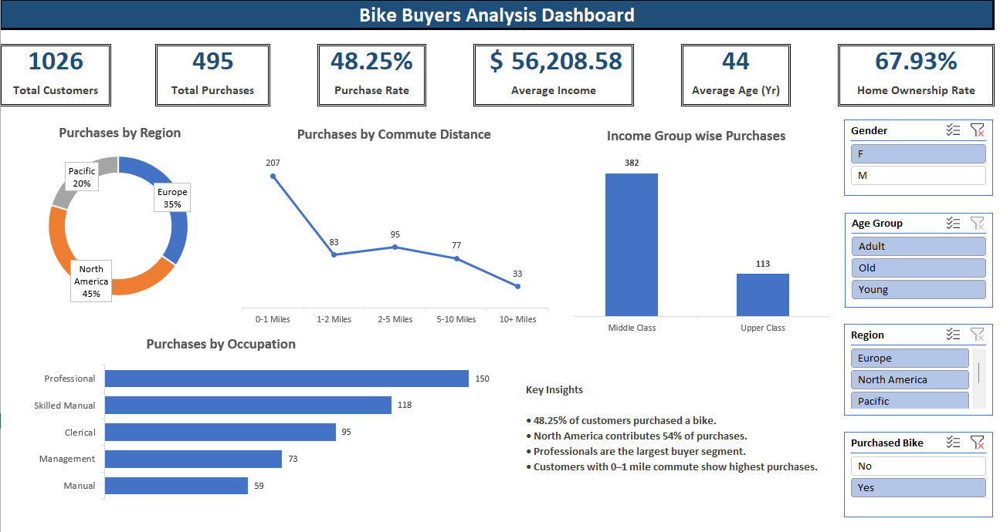

# 🚲 Bike Buyers Analysis Dashboard (Excel)

## 📌 Project Overview

This project presents an interactive Excel dashboard built using the Bike Buyers dataset. The objective was to analyze customer purchasing behavior and identify key factors influencing bike purchases.

The dashboard uses Pivot Tables, Pivot Charts, KPI Cards, and Slicers to transform raw customer data into actionable insights.

---

## 📊 Dashboard Preview

---

## 🎯 Objectives

- Analyze bike purchasing trends.
- Identify customer demographics associated with purchases.
- Compare purchase behavior across regions.
- Evaluate the impact of commute distance and occupation on bike purchases.
- Present findings through an interactive Excel dashboard.

---

## 🛠 Tools & Features Used

### Microsoft Excel
- Pivot Tables
- Pivot Charts
- Slicers
- KPI Cards
- Data Cleaning
- Dashboard Design

---

## 📈 Key Performance Indicators (KPIs)

| KPI | Value |
|------|------|
| Total Customers | 1,026 |
| Total Purchases | 495 |
| Purchase Rate | 48.25% |
| Average Income | $56,208.58 |
| Average Age | 44 Years |
| Home Ownership Rate | 67.93% |

---

## 📊 Dashboard Components

### Purchases by Region
Visualizes the distribution of bike purchases across:
- North America
- Europe
- Pacific

### Purchases by Commute Distance
Shows how commute distance impacts bike purchasing behavior.

### Income Group-wise Purchases
Compares purchase counts across customer income groups.

### Purchases by Occupation
Ranks occupations based on total bike purchases.

### Interactive Filters
Users can filter the dashboard by:
- Gender
- Age Group
- Region
- Purchase Status

---

## 🔍 Key Insights

- 48.25% of customers purchased a bike.
- North America contributed the largest share of purchases.
- Professionals represented the largest buyer segment.
- Customers with shorter commute distances showed higher purchase counts.
- Home ownership rate among customers was approximately 68%.

---

## 📂 Dataset

The dataset contains customer demographic and purchasing information, including:

- Gender
- Age
- Income
- Marital Status
- Occupation
- Region
- Home Ownership
- Commute Distance
- Purchased Bike

---

## 🚀 Skills Demonstrated

- Data Cleaning
- Data Analysis
- Dashboard Development
- Data Visualization
- Business Insight Generation
- Excel Reporting

---

## 👨‍💻 Author

**Medhavi Agrawal**  
Aspiring Data Analyst | Excel | SQL | Power BI
